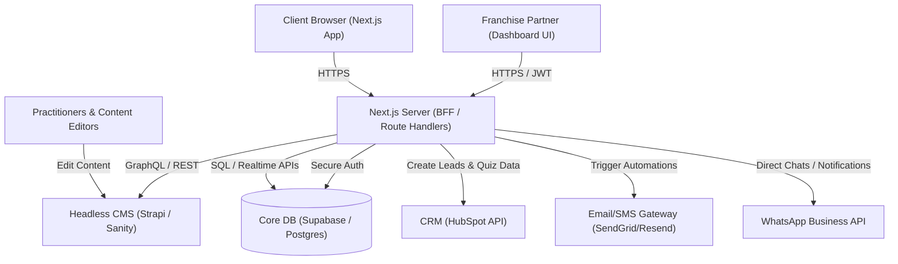

# INFC Morocco - Technical API Integration Plan

This document outlines the architecture, backend endpoints, and third-party integrations required to transition the INFC website from static and mock data to a fully dynamic web application.

It is designed for the backend, database, and marketing automation teams to understand the required API contracts, payloads, and structural schemas.

---

## 1. High-Level Architecture Diagram

Below is the proposed integration topology. Next.js functions as both the frontend and the BFF (Backend-for-Frontend) layer to securely orchestrate requests between client browsers, core databases, and external SaaS providers (CRM, CMS, Mailing).



---

## 2. Global Integration Registry & Deliverables

| Target Page / Component | Primary Feature | Core API Type | External Dependency | Action Owner |
| :--- | :--- | :--- | :--- | :--- |
| **Blog & Resources** | Dynamic article directories, dynamic post page | Headless CMS | Strapi / Sanity / Contentful | CMS Editor / Backend Team |
| **Forum Q&A** | Parent discussions, votes, and expert responses | Custom REST API | Postgres Database + JWT Auth | Backend Team |
| **Contact Form** | Inquiry collection, routing by city | POST Hook + CRM | HubSpot + SendGrid / Resend | Marketing Ops / CRM Specialist |
| **Brain Boost Quiz** | Lead capture, scorecard calculation | Lead POST | HubSpot + Mailchimp / ActiveCampaign | Frontend & CRM Teams |
| **Centres & Maps** | Dynamic location info, booking | Location API + Booking widget | Calendly / Doctolib / Custom CRM | Operations / Backend Team |
| **Franchise Dashboard** | Real-time franchisee reporting, materials | Authenticated portal | Postgres + Supabase Auth / Storage | Backend & Analytics Teams |
| **Success Stories** | Translated testimonials with metrics | Database / CMS | Headless CMS | Content Team |
| **Pricing & Tarifs** | Dynamically updated packages | Config API | Database or Headless CMS | Admin Panel Owner |

---

## 3. Detailed Page-by-Page Specifications & API Contracts

### 3.1. Blog & Articles Page (`/blog` and `/blog/[slug]`)
* **Current State**: Static array of 3 hardcoded articles in French, no dynamic routing.
* **Target State**: Fully dynamic localized article lists. Clicking an article navigates to a `/blog/[slug]` route populated by rich-text CMS content.

#### API Endpoint Required:
* **`GET /api/posts`** (Get list of articles)
  * **Query Parameters**:
    * `locale` (string: `fr` \| `ar` \| `en`) - Required
    * `category` (string, optional) - Filter by tag (e.g. `guide`, `neuroscience`, `sommeil`)
    * `page` (number, default: `1`) - Pagination
    * `limit` (number, default: `10`) - Pagination limit
  * **Expected Response Schema (JSON)**:
    ```json
    {
      "data": [
        {
          "id": "post-uuid-1",
          "slug": "preparer-cerveau-examens",
          "icon": "📚",
          "category": "Guide Pratique",
          "title": "Préparer le cerveau pour les examens",
          "description": "Ce que la neuroscience nous apprend vraiment sur la surcharge cognitive...",
          "published_at": "2026-05-20T10:00:00Z"
        }
      ],
      "meta": {
        "pagination": {
          "page": 1,
          "pageSize": 10,
          "pageCount": 5,
          "total": 47
        }
      }
    }
    ```

* **`GET /api/posts/[slug]`** (Get detailed post content)
  * **Query Parameters**:
    * `locale` (string)
  * **Expected Response Schema (JSON)**:
    ```json
    {
      "id": "post-uuid-1",
      "slug": "preparer-cerveau-examens",
      "icon": "📚",
      "category": "Guide Pratique",
      "title": "Préparer le cerveau pour les examens",
      "description": "Ce que la neuroscience nous apprend...",
      "content": "<h2>Introduction</h2><p>La surcharge cognitive est...</p><h3>Le Rôle du Cortisol</h3>...",
      "published_at": "2026-05-20T10:00:00Z",
      "author": {
        "name": "Dr. Chadia Chakib",
        "avatar": "/assets/images/team/chadia.jpg"
      }
    }
    ```

---

### 3.2. Contact Form (`/contact`)
* **Current State**: Submissions route to `/api/contact` which console logs and returns a mock success message.
* **Target State**: Leads are created in HubSpot, flagged with the user's city, and email alerts are sent to the corresponding center's staff.

#### API Endpoints Required:
* **`POST /api/contact`**
  * **Request Payload**:
    ```json
    {
      "name": "Yasmina Alaoui",
      "phone": "+212661234567",
      "city": "casablanca",
      "message": "Bonjour, je souhaite prendre rendez-vous pour mon fils de 14 ans."
    }
    ```
  * **Integration Logic**:
    1. Validate fields (server-side phone format validation).
    2. Submit lead to HubSpot Contacts API.
    3. Determine recipient email based on `city` (e.g. `casablanca@neuromaroc.com`).
    4. Send immediate notification via SendGrid/Resend with form details.
  * **Response**:
    ```json
    {
      "success": true,
      "message": "Votre demande a été enregistrée. Un praticien INFC vous recontactera sous 24 heures."
    }
    ```

---

### 3.3. Forum (`/forum`)
* **Current State**: Stored in local storage. Votes and submissions are ephemeral and reset across browsers.
* **Target State**: Persistent community-driven forum where parents ask questions, other parents can vote to show interest, and verified INFC practitioners can answer questions.

#### Database Tables Structure (PostgreSQL):
```sql
CREATE TYPE forum_category AS ENUM ('sommeil', 'attention', 'stress', 'hyperactivite');

CREATE TABLE forum_questions (
    id UUID PRIMARY KEY DEFAULT gen_random_uuid(),
    title VARCHAR(255) NOT NULL,
    description TEXT,
    category forum_category NOT NULL,
    author_name VARCHAR(100) NOT NULL DEFAULT 'Anonyme',
    votes INT DEFAULT 1,
    approved BOOLEAN DEFAULT FALSE, -- Moderation check
    created_at TIMESTAMP WITH TIME ZONE DEFAULT CURRENT_TIMESTAMP
);

CREATE TABLE forum_answers (
    id UUID PRIMARY KEY DEFAULT gen_random_uuid(),
    question_id UUID REFERENCES forum_questions(id) ON DELETE CASCADE,
    author_name VARCHAR(100) NOT NULL,
    author_title VARCHAR(150) NOT NULL, -- e.g. "Fondatrice d'INFC Maroc"
    text TEXT NOT NULL,
    created_at TIMESTAMP WITH TIME ZONE DEFAULT CURRENT_TIMESTAMP
);
```

#### API Endpoints Required:
* **`GET /api/forum`** (Fetch approved questions and their answers)
  * **Query Parameters**: `category` (optional), `sort_by` (default: `votes`), `limit`, `page`
  * **Expected Response Schema**:
    ```json
    {
      "questions": [
        {
          "id": "q-uuid-123",
          "title": "Mon enfant a des maux de ventre réguliers avant l'école...",
          "description": "Il a 12 ans, l'approche du collège l'angoisse...",
          "category": "stress",
          "author": "Khadija (Maman de Rayane)",
          "date": "2026-05-20T14:30:00Z",
          "votes": 54,
          "answer": {
            "authorName": "Dr. Chadia Chakib",
            "authorTitle": "Fondatrice d'INFC Maroc",
            "text": "Bonjour Khadija. Les maux de ventre matinaux..."
          }
        }
      ]
    }
    ```

* **`POST /api/forum`** (Submit a new question - needs moderation queue)
  * **Payload**: `{ "title": "...", "description": "...", "category": "sommeil", "anonymous": true }`
  * **Behavior**: Saves to `forum_questions` with `approved = false`. Triggers practitioner Slack/Email alert for approval/answering.

* **`POST /api/forum/[id]/vote`** (Upvote/Downvote toggle)
  * **Payload**: `{ "action": "upvote" | "downvote" }`
  * **Authentication**: Track IP / Cookie hashes to prevent voting spam.

* **`POST /api/forum/[id]/answer`** (Practitioner submission)
  * **Headers**: `Authorization: Bearer <JWT_TOKEN>` (Restricted to INFC practitioners)
  * **Payload**: `{ "text": "..." }`
  * **Behavior**: Inserts reply and marks question as answered.

---

### 3.4. Franchise Dashboard (`/franchise-dashboard`)
* **Current State**: Non-functional landing placeholder.
* **Target State**: Private portal for franchise managers to monitor center analytics, access documents, and log training hours.

#### API Endpoints Required:
* **`POST /api/auth/login`**
  * **Payload**: `{ "email": "casablanca@neuromaroc.com", "password": "••••••••" }`
  * **Response**: `{ "token": "JWT_STRING_HERE", "user": { "center": "Casablanca", "role": "franchisee" } }`

* **`GET /api/franchise/analytics`**
  * **Headers**: `Authorization: Bearer <JWT_TOKEN>`
  * **Expected Response Schema**:
    ```json
    {
      "revenue": {
        "currentMonth": 145000,
        "previousMonth": 132000,
        "growth": 9.8
      },
      "activeClients": 42,
      "sessionsCompleted": 184,
      "npsScore": 4.9,
      "weeklyTrends": [
        { "week": "W19", "sessions": 40 },
        { "week": "W20", "sessions": 45 },
        { "week": "W21", "sessions": 48 },
        { "week": "W22", "sessions": 51 }
      ]
    }
    ```

* **`GET /api/franchise/resources`**
  * **Headers**: `Authorization: Bearer <JWT_TOKEN>`
  * **Response**: Lists download links for marketing kits, protocol changes, and invoice templates.

---

### 3.5. Brain Boost Pack & Quiz (`/brain-boost` & `BrainBoostQuiz.tsx`)
* **Current State**: Test operates completely client-side. The score calculation generates a radar chart, and the parent is prompted to click static links to download the guide or text on WhatsApp.
* **Target State**: In exchange for results, parents submit contact info. The system registers the details along with individual category vulnerability percentages directly into HubSpot to kick off email-drip campaigns.

#### API Endpoint Required:
* **`POST /api/quiz-lead`**
  * **Request Payload**:
    ```json
    {
      "email": "parent@example.com",
      "name": "Amin El Fassi",
      "phone": "+212678901234",
      "city": "Marrakech",
      "scores": {
        "fatigue_attentionnelle": 66.6,
        "dette_sommeil": 33.3,
        "niveau_stress": 100.0,
        "charge_memorielle": 0.0
      }
    }
    ```
  * **Backend Integration Logic**:
    1. Insert lead into HubSpot contact database.
    2. Tag contact with: `BrainBoost-Quiz-Taker`.
    3. Map scores to custom properties in HubSpot CRM (useful for personalized practitioner calls).
    4. Fire a webhook to Mailchimp/ActiveCampaign to send the PDF Guide automatically.

---

### 3.6. Centres & Maps (`/centres`)
* **Current State**: Data list is hardcoded in component arrays. Maps point to generic queries.
* **Target State**: Centers list loaded dynamically. Users can check session availability or book directly.

#### API Endpoint Required:
* **`GET /api/centres`**
  * **Expected Response Schema**:
    ```json
    {
      "centres": [
        {
          "id": "centre-casablanca",
          "name": "INFC Casablanca",
          "address": {
            "fr": "Nº12 2ème étage, Immeuble Living office 362 BD Ghandi Oasis",
            "ar": "رقم 12 الطابق الثاني، عمارة ليفينج أوفيس، 362 شارع غاندي، الواحة",
            "en": "No. 12 2nd floor, Living office Building, 362 BD Ghandi Oasis"
          },
          "phone": "0522991783",
          "whatsapp": "212622606011",
          "hours": {
            "fr": "Lundi‑Samedi : 09h00 – 19h00",
            "ar": "الاثنين - السبت: 09:00 صباحًا - 07:00 مساءً",
            "en": "Monday‑Saturday: 09:00 AM – 07:00 PM"
          },
          "bookingUrl": "https://calendly.com/infc-casablanca",
          "images": [
            "/assets/images/neurofeedback-casablanca-1-480.jpg"
          ]
        }
      ]
    }
    ```

---

## 4. Key Actions Required from Backend Team

To implement these updates, the core backend team must deliver:
1. **CMS Configuration**: A headless CMS project (e.g., Strapi) containing content models for `Articles`, `Centres`, and `Testimonials`.
2. **Database Provisioning**: Set up a PostgreSQL instance (e.g. Supabase project) with tables for `forum_questions`, `forum_answers`, and `franchise_analytics`.
3. **HubSpot OAuth and Key Access**: Provide API Keys or OAuth credentials to interact with:
   - Create Contact endpoints.
   - Custom properties configuration (for mapping quiz scores).
4. **Auth0 / Supabase JWT Issuer**: Configure an authentication system to secure the `/api/franchise` endpoints.

---

## 5. Security & Performance Guidelines

* **Cross-Site Request Forgery (CSRF)**: Protect contact form routes with hidden anti-CSRF tokens, or restrict requests using CORS policies to `neuromaroc.com` domains only.
* **Rate Limiting**: Limit API requests on dynamic routes (especially `/api/forum` and `/api/contact`) to a maximum of 5 posts per minute per IP to prevent spam.
* **Content Cache Strategy (ISR)**: Use Next.js Incremental Static Regeneration (ISR) with a revalidation time of:
  * 1 hour for **Blog Articles** (`revalidate = 3600`).
  * 24 hours for **Centres** (`revalidate = 86400`).
  * 10 seconds for **Forum** to maintain live community engagement.
